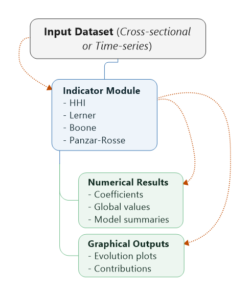

# Summary

The Competitive analysis is a crucial component for firms operating in dynamic markets. Understanding market structure and the intensity of competition enables organizations to adjust strategies and make informed decisions. 
In this paper, we propose a dual open-source package for both Python and R environments that implements four of the most widely used competition measures in the literature: the Herfindahl–Hirschman Index (HHI), the Lerner Index, 
the Boone Indicator, and the Panzar–Rosse statistic. These packages provide researchers, practitioners, and students with a ready-to-use framework for conducting competition analysis. They are designed to handle both cross-sectional 
and time-series datasets and are adaptable to various sectors, including insurance, banking, and other competitive industries. The packages that we have introduced in this study are already available as open-source on GitHub , 
and will also be released on CRAN (as MarketCompetitionMetrics.R), and PyPI (as market_competition_metrics). To the best of our knowledge, this work represents the first open-source effort to implement and unify these four competition metrics within both R and Python ecosystems.

# Statement of need

The In today’s digitalized economy, firms must continuously analyze the markets in which they operate in order to adapt strategies and make informed decisions. The regulators of the markets also require reliable tools to assess market structure and ensure proper regulation. Market competition can vary significantly, ranging from monopolistic and duopolistic settings to highly competitive environments.
Several economic indicators have been developed to measure the degree of competition within a market. Among the most widely used are the Herfindahl–Hirschman Index (HHI), introduced by Herfindahl and Hirschman (1945-1950)(Herfindahl, 1950; Hirschman, 2018) the Lerner index (Lerner, 1934), the Boone indicator (Boone, 2008; Boone et al., 2007) and the Panzar–Rosse H-statistic (Panzar & Rosse, 1987; Rosse & Panzar, 1977). These metrics have been applied across different industries to evaluate competitive intensity. For instance, Abel and Marire (Abel & Marire, 2021) employed the Boone Indicator to measure competitiveness in Zimbabwe’s insurance sector between 2010 and 2017; Mpho and Witness (Mpho & Witness, 2020) used both Boone and Panzar–Rosse indices to assess competition in South Africa’s banking industry; and Benazzi et al. (BENAZZI & ROUIESSI, 2017) analyzed the Moroccan banking sector using the Boone Indicator. Similarly, the HHI has frequently been used to evaluate market concentration, such as in Johan and Vania (Johan & Vania, 2022), who investigated the concentration level of the financial technology industry.
Despite their extensive use in academic and policy research, these metrics are often computed using ad hoc scripts, combinations of statistical software, or partial code shared on platforms such as GitHub. This reflects a lack of standardized, accessible implementations in mainstream programming environments.
The objective of this article is to address this gap by introducing an open-source framework in both Python and R that implements the four principal competition measures: HHI, Lerner Index, Boone Indicator, and Panzar–Rosse statistic, within a unified package. This dual implementation is designed to support researchers, practitioners, and students in conducting robust and reproducible analyses of market competition.

The Herfindahl–Hirschman Index (HHI) is one of the few competition measures sometimes available in standard econometric software, for instance through the hhi command in Stata or the IC2 package in R. An additional contribution in this space is the work of Philip D. Waggoner, who developed an R package computing the HHI index with integrated visualization via ggplot (D. Waggoner, 2018). By contrast, other widely used indicators of competition are not natively supported in mainstream tools.
The Lerner Index is typically computed manually from price and marginal cost estimations, often relying on custom regressions in Stata, R, or Python. The Boone Indicator is even less standardized, most often estimated through ad hoc log-log OLS regressions, with implementation scattered across isolated R scripts or Stata modules. Similarly, the Panzar–Rosse H-statistic, though extensively applied in banking competition studies (e.g., (Abel & Le Roux, 2017; BENAZZI & ROUIESSI, 2017; Molyneux et al., 1994; Shaffer & Spierdijk, 2015)), is usually calculated using researcher-specific scripts rather than through an official package.
As a result, HHI is the only measure readily accessible in mainstream software, while the Lerner, Boone, and Panzar–Rosse indicators remain fragmented across custom, non-standard implementations. The contribution of this work is therefore to provide the first unified open-source Python and R packages that centralize all four indicators, delivering a consistent, ready-to-use framework for researchers and practitioners conducting market competition analysis.

# Mathematical foundations

## Herfindahl–Hirschman Index (HHI)

The HHI measures market concentration as the sum of squared market shares:

$$HHI_t = \sum_{i=1}^{n} S_{i,t}^2$$

Its value ranges between 0 (highly competitive market) and 10 000 (monopoly).

## Lerner Index

The firm-level Lerner index quantifies market power by comparing price to marginal cost:

$$L_{i,t} = \frac{P_{i,t} - MC_{i,t}}{P_{i,t}}$$

The market-wide index is computed as a market-share–weighted average.

## Panzar–Rosse H-statistic

The Panzar–Rosse model estimates the elasticity of revenues with respect to input prices via a log–log specification:

$$\ln R_{i,t} = \alpha + \sum_k \alpha_{k,t} \ln C_{k,i,t}$$

The H-statistic is defined as:

$$H_t = \sum_k \alpha_{k,t}$$

Its interpretation follows established competition theory:  
- \(H = 1\): perfect competition  
- \(0 < H < 1\): monopolistic competition  
- \(H \le 0\): monopoly or collusive behavior

## Boone Indicator

The Boone Indicator captures the effect of marginal costs on profitability through a log–log regression:

$$\ln \pi_{i,t} = \lambda + \sum_k \beta_{k,t} \ln C_{k,i,t}$$

with:

$$\beta = \sum_k \beta_{k,t}$$

Negative values of $$\beta$$ indicate strong competition.

# Package description

The design of the packages supports both cross-sectional and time-series datasets. For cross-sectional data, the functions return the competition indicators along with their estimated parameters. For time-series data, the packages include a graphical option that allows users to visualize the evolution of the indices over time. For instance, when applying the Boone indicator, the packages return: The estimated Boone coefficients, the global Boone value for each period, and two graphical outputs illustrating the evolution of the indicator across time. The figure below presents the workflow of the python and R packages.

**Fig. 1. Workflow of the Python and R packages.**

In addition to this unified workflow, the Python implementation relies on a set of widely used scientific libraries to ensure numerical stability and statistical rigor. NumPy is used for vectorized computations, pandas for data manipulation and grouping operations, matplotlib for producing time-series visualizations, and statsmodels for estimating the Boone and Panzar–Rosse regressions, including their associated econometric diagnostics.

Similarly, the R implementation depends on well-established packages from the tidyverse ecosystem. The dplyr package enables streamlined data manipulation and grouping operations, ggplot2 provides graphical visualization of the indices over time, and broom is used to extract tidy regression outputs for the Boone and Panzar–Rosse models. Together, these dependencies ensure that the R version delivers the same analytical consistency, interpretability, and reproducibility as its Python counterpart.
